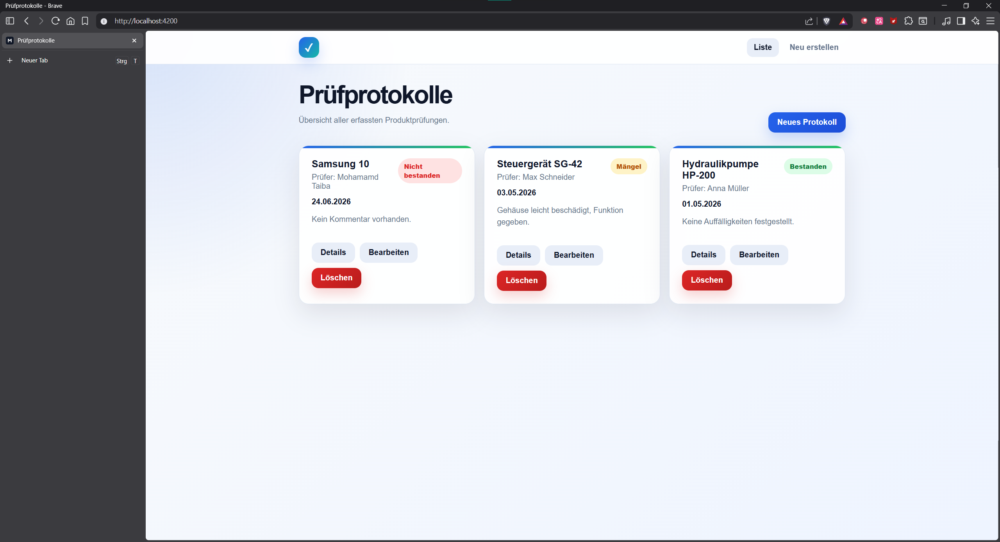
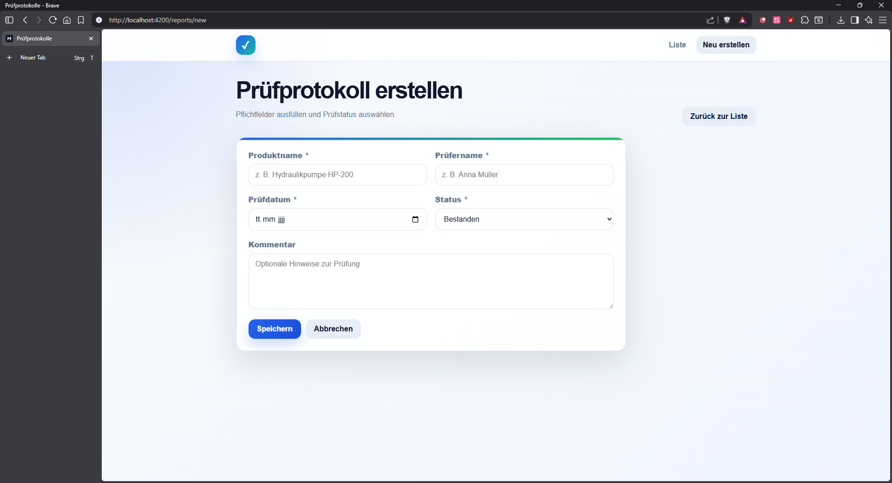
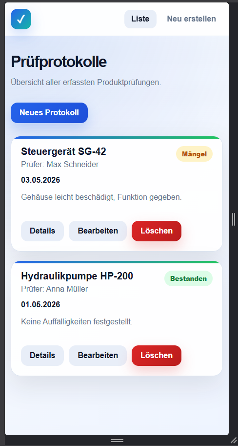

# Prüfprotokoll-App


Eine Fullstack-Webanwendung zur Verwaltung von Prüfprotokollen. Das Projekt zeigt eine saubere Umsetzung einer kleinen Business-Anwendung mit Angular-Frontend, ASP.NET-Core-Web-API, Entity Framework Core, PostgreSQL, Docker und automatisierter CI/CD-Pipeline.

Die Anwendung wurde als kompaktes Portfolio-Projekt entwickelt und demonstriert typische Aufgaben aus der modernen Webentwicklung: Formularvalidierung, REST-Kommunikation, Datenpersistenz, serviceorientierte Backend-Struktur, Containerisierung und automatisierte Qualitätsprüfungen.

## Projektziel

Ziel des Projekts ist eine einfache, nachvollziehbare Prüfprotokoll-Verwaltung, mit der Prüfberichte erstellt, angezeigt, bearbeitet und gelöscht werden können. Der Fokus liegt nicht auf Funktionsumfang, sondern auf einer klaren technischen Struktur, reproduzierbarem Setup und nachvollziehbarer Codequalität.

## Funktionen

* Prüfprotokolle erstellen, anzeigen, bearbeiten und löschen
* Detailansicht für einzelne Prüfprotokolle
* Statusauswahl mit `Bestanden`, `Mängel` und `Nicht bestanden`
* Formularvalidierung im Frontend
* Serverseitige Validierung im Backend
* PostgreSQL-Datenbank mit EF-Core-Migration und Seed-Daten für Demo-Zwecke
* Responsive Oberfläche für Desktop und Smartphone
* REST-API mit klaren Endpunkten
* Docker-Setup für Frontend, Backend und PostgreSQL
* GitHub-Actions-Pipeline für Installation, Tests, Linting, Build und Docker-Image-Erstellung


## Screenshots

### Übersicht der Prüfprotokolle



### Prüfprotokoll erstellen



### Responsive Ansicht



## Tech Stack

| Bereich | Technologie |
|---|---|
| Frontend | Angular 17, TypeScript, HTML, CSS |
| Backend | ASP.NET Core Web API, C#, .NET 8 |
| Datenbank | PostgreSQL, Entity Framework Core 8 |
| Tests | xUnit/.NET Tests, Angular/Karma/Jasmine |
| Webserver | Nginx für das Angular-Frontend im Docker-Container |
| Containerisierung | Docker, Docker Compose |
| CI/CD | GitHub Actions, GitHub Container Registry |

## Architektur

```text
Browser
  |
  | HTTP
  v
Angular Frontend
  |
  | /api/inspectionreports
  v
ASP.NET Core Web API
  |
  | Entity Framework Core
  v
PostgreSQL-Datenbank
```

Im lokalen Entwicklungsmodus leitet Angular API-Aufrufe über `proxy.conf.json` an das Backend weiter. Im Docker-Betrieb übernimmt Nginx die Weiterleitung von `/api` an den Backend-Container.

## Projektstruktur

```text
pruefprotokoll-app/
├── .github/
│   └── workflows/
│       └── ci-cd.yml
├── backend/
│   ├── Pruefprotokoll.Api/
│   │   ├── Controllers/
│   │   ├── Data/
│   │   ├── Migrations/
│   │   ├── Models/
│   │   ├── Repositories/
│   │   ├── Services/
│   │   └── Program.cs
│   ├── Pruefprotokoll.Tests/
│   └── Dockerfile
├── frontend/
│   ├── src/app/components/
│   ├── src/app/models/
│   ├── src/app/services/
│   ├── proxy.conf.json
│   ├── nginx.conf
│   └── Dockerfile
├── docker-compose.yml
└── README.md
```

## Voraussetzungen

Für den Start mit Docker:

* Docker Desktop
* Docker Compose

Für den lokalen Start ohne Docker:

* .NET 8 SDK
* Node.js 20 oder kompatibel
* npm
* PostgreSQL 16 oder kompatibel

## Start mit Docker

Im Hauptordner des Projekts ausführen:

```bash
docker compose up --build
```

Danach ist die Anwendung erreichbar unter:

```text
http://localhost:4200
```

Die API ist erreichbar unter:

```text
http://localhost:5000/api/inspectionreports
```

Docker Compose startet drei Services:

```text
frontend   Angular-Build mit Nginx auf Port 4200
backend    ASP.NET-Core-Web-API auf Port 5000
postgres   PostgreSQL-Datenbank auf Port 5432
```

Die Datenbankdaten werden im Docker-Volume `postgres_data` gespeichert.

Container stoppen:

```bash
docker compose down
```

Container inklusive Datenbank-Volume löschen:

```bash
docker compose down -v
```

Container neu bauen:

```bash
docker compose build --no-cache
docker compose up
```

## Backend lokal starten

PostgreSQL lokal starten und folgende Datenbank bereitstellen:

```text
Host: localhost
Port: 5432
Database: inspectionreports
Username: postgres
Password: postgres
```

Danach Backend starten:

```bash
cd backend/Pruefprotokoll.Api
dotnet restore
dotnet run
```

Die API läuft danach unter:

```text
http://localhost:5000
```

Beim ersten Start werden die EF-Core-Migrationen automatisch angewendet und zwei Demo-Datensätze eingespielt.

## Frontend lokal starten

In einem zweiten Terminal:

```bash
cd frontend
npm install
npm start
```

Die Angular-App läuft danach unter:

```text
http://localhost:4200
```

Das Frontend nutzt im lokalen Entwicklungsmodus `proxy.conf.json`, damit API-Aufrufe an `/api` automatisch an das Backend weitergeleitet werden.

## Tests und Qualitätssicherung

Backend-Tests ausführen:

```bash
cd backend/Pruefprotokoll.Tests
dotnet test
```

Frontend-Tests lokal ausführen:

```bash
cd frontend
npm test
```

Frontend-Tests im Headless-Modus ausführen, wie in der CI-Pipeline:

```bash
cd frontend
npm test -- --watch=false --browsers=ChromeHeadless
```

Frontend builden:

```bash
cd frontend
npm run build
```
